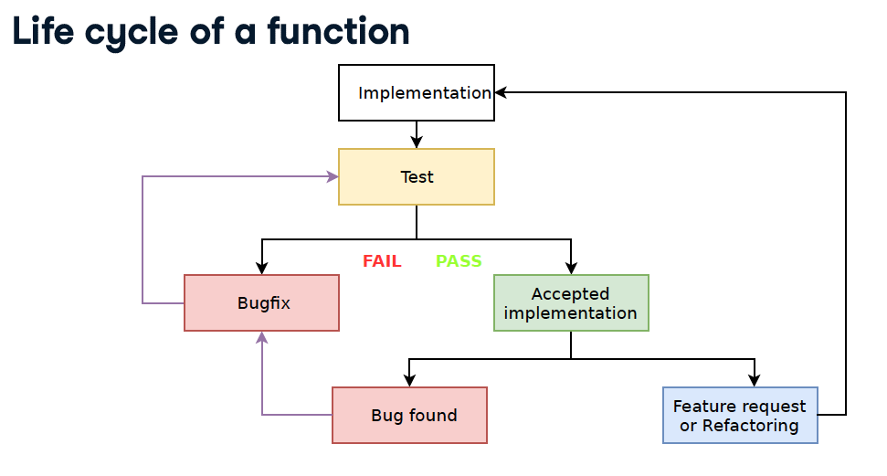
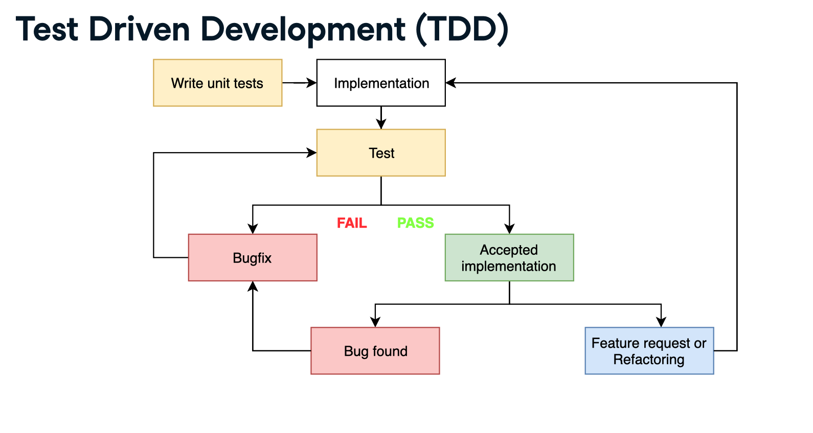

[](https://travis-ci.com/jdquerales/UnivariateLinearModel-Pytest)
[](https://codecov.io/gh/jdquerales/UnivariateLinearModel-Pytest)

This repository holds my own code implementation for the DataCamp course [Unit Testing for Data Science in Python by Dibya Chakravorty](https://www.datacamp.com/courses/unit-testing-for-data-science-in-python). 

Please make sure that you have installed the package `univariate_linear_regression` in this repo using `pip` before running `pytest`. Otherwise, you may get `ImportError`s.

To install it, first clone the repo.

```
git clone https://github.com/jdquerales/UnivariateLinearModel-Pytest.git
```

Then install the package locally using `pip`, making sure that you are using Python version `>=3.6`.

```
Go to project folder and execute: pip install .
```

Once the installation finishes, you can run all the tests by doing 

```
pytest --mpl
```




